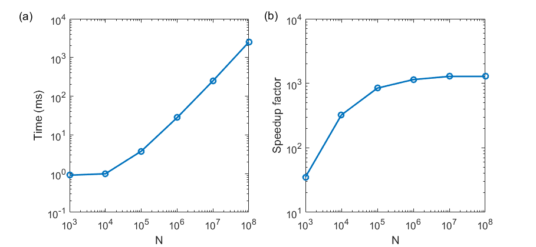

# Chapter 5 Prerequisites for obtaining high performance in CUDA programs


In the previous chapters, we have only discussed the correctness of a CUDA program. Starting from this chapter, we will focus on the performance of CUDA programs. 

## 5.1 Using CUDA events to time a block of code

There are many methods of timing for a block of code in a CUDA program, but here we only introduce a method based on CUDA events:

```c++
cudaEvent_t start, stop;
CHECK(cudaEventCreate(&start));
CHECK(cudaEventCreate(&stop));
CHECK(cudaEventRecord(start));
cudaEventQuery(start); // cannot use the macro function CHECK here

// The code block to be timed

CHECK(cudaEventRecord(stop));
CHECK(cudaEventSynchronize(stop));
float elapsed_time;
CHECK(cudaEventElapsedTime(&elapsed_time, start, stop));
printf("Time = %g ms.\n", elapsed_time);

CHECK(cudaEventDestroy(start));
CHECK(cudaEventDestroy(stop));
```

This timing method can be understood as follows:

* First, we define two CUDA events, `start` and `stop`, which are of type `cudaEvent_t`, and then initialize them using the `cudaEventCreate` function.
* Next, we pass `start` into the function `cudaEventRecord` to record a time stamp representing the start of the code block to be timed. The next call to `cudaEventRecord` is only necessary for GPUs in the WDDM mode.
* Then, after the code block, we pass `stop` into the function `cudaEventRecord` to record a time stamp representing the end of the code block. The next call to `cudaEventSynchronize` forces the host to wait for the completion of the previous statement.
* Then, we use the function `cudaEventElapsedTime` to calculate the time interval `elapsed_time` between `stop` and `start`, in units of ms (micro second, or 1/1000 second).
* The last two lines are used to clean up resources. 

We first use this method time time the `add1cpu.cu` program of this chapter, which is adapted from the `add.cpp` program of chapter 3. We can use the following command to compile a version using single-precision floating point numbers in the code:

```shell
$ nvcc -O3 -arch=sm_75 add1cpu.cu
```

If we want to get a version using double-precision floating point numbers, we can use the the following command:

```shell
$ nvcc -O3 -arch=sm_75 -DUSE_DP add1cpu.cu
```

We can similarly build the single-precision and double-precision versions of the corresponding CUDA program `add2gpu.cu` of this chapter. Using single-precision, the host function `add` in `add1cpu.cu` takes about 60 ms and the CUDA kernel `add` in `add2gpu.cu` takes about 3.3 ms. Using double precision, they take about 120 ms and 6.8 ms, respectively. The author also tested the CUDA program `add2gpu.cu` using other GPUs, including K40, P100, V100, and RTX 2080ti. The relevant timing results are presented in the following table:

| V100 (S) | V100 (D) | 2080ti (S) | 2080ti (D) | P100 (S) | P100 (D) | 2070 (S) | 2070 (D) | K40 (S) | K40 (D) |
| :------- | :------- | :--------- | :--------- | :------- | :------- | :------- | :------- | :------ | :------ |
| 1.5 ms   | 3.0 ms   | 2.1 ms     | 4.3 ms     | 2.2 ms   | 4.3 ms   | 3.3 ms   | 6.8 ms   | 6.5 ms  | 13 ms   |

From the testing results, we see that for all the machines (CPU or GPUs), the double-precision version is about 2X as slow as the corresponding single-precision version. This is because the array addition problem is dominated by memory accessing, rather than floating point computations.

We can also calculate the effective memory bandwidth of a task, which is defined as the accessed number of bytes divided by time used. Taking RTX 2070 and single-precision as an example, the effective band width is 3 * 1.0e8 * 4 B / 3.3 ms ~ 360 GB/s, which is slightly smaller than the theoretical band width of this GPU (448 GB/s). When the effective band width of a task is close to the theoretical band width, it indicates that the task is memory accessing bounded, not floating point computation bounded. The performance (inverse of time) of the `add` kernel is roughly proportional to the theoretical band width of the GPU.

## 5.2 Factors affecting GPU acceleration

Using RTX 2070, the speedup factor of the CUDA kernel over the corresponding host function is 60/3.3, which is about 17. This is not very low, but is also not very high. In this section, we discuss when a high speedup factor can be obtained.

### 5.2.1 Ratio of data transfer

In the program `add2gpu.cu`, we have only timed the CUDA kernel. Here, we also include the data transfer before and after the kernel into the code block to be timed, as in the program `add3memcpy.cu`. Using RTX 2070, this part takes 180 ms and 360 ms, respectively, for the single-precision and double-precision versions. We see that if we include the time spent on data transfer, the CUDA program is even 3 times as slow as the C++ program. The reason is that the bandwidth of GPU memory accessing is more than one order of magnitude higher than the bandwidth of data transfer between CPU and GPU (through PCIe). 

In a realistic CUDA program, the whole task should never be adding up to arrays only. That would be a very stupid CUDA application. There must be more calculations in the device with more kernel invocations. One of the most important principles for CUDA programming is to minimize the amount of data transfer between host and device. For most of the examples in this book, however, the time spending on the kernel might be a small fraction of the time for whole CUDA program, and the reader should understand that the major purpose of these examples is to demonstrate how to optimize the kernel performance. 

### 5.2.2 Arithmetic intensity

The speedup factor in the array addition problem is not very high (only considering the kernel and the host function, as we remarked above), which is mainly due to the low **arithmetic intensity** in this problem. The **arithmetic intensity** of a problem refers to the ratio between the amount of arithmetic operations and the amount of the memory operations that are used to support the arithmetic operations. The arithmetic intensity of the array addition problem is quite low, because there is a single floating point addition with 3 global memory accessing events (two reads and one write). The function `arithmetic` in the programs `arithmetic1cpu.cu` and `arithmetic2gpu.cu` has much larger arithmetic intensity:

```c++
const real x0 = 100.0;
void __global__ arithmetic(real *d_x, const real x0, const int N)
{ 
    const int n = blockDim.x * blockIdx.x + threadIdx.x;
    if (n < N)
    {
        real x_tmp = d_x[n];
        while (sqrt(x_tmp) < x0)
        {
            ++x_tmp;
        }
        d_x[n] = x_tmp;
    }
}
```

When the array length is 10 000, the host function takes 320 ms and 450 ms, using single and double precision floating point numbers, respectively. When the array length is 1000 000, the kernel with GeForce RTX 2070 takes 28 ms and 1000 ms, using single and double precision floating point numbers, respectively. Therefore, the speedup factor is about 1100 and 45 using single and double precision floating point numbers, respectively. We also note that in this case, using single-precision floating point numbers is much faster, which is a strong indicator of the high arithmetic intensity of the kernel. If we change to use Tesla V100 to test, the times used by the kernel are 11 ms (single precision) and 28 ms (double precision), showing much less difference between single and double precision floating point numbers.

### 5.2.3 Degree of parallelism 

The **degree of parallelism** for a CUDA kernel is essentially the total number of threads assigned for the kernel. Each GPU consists of multiple streaming multiprocessors (SM) and each SM has a number of CUDA cores. Each SM can support about 1024 parallel threads and a typical GPU can thus support at least tens of thousands of parallel threads. If the number of threads assigned for a CUDA kernel is much smaller than this number, it would be hard to get high performance.



We change the array length `N` from 10^3 to 10^8 and time the kernel, using single precision. The kernel execution times obtained using a GeForce RTX 2070 are shown in panel (a) of the above figure. The corresponding speedup factors relative to the CPU function are shown in panel (b). When `N` is large, the kernel execution time is proportional to `N`, and the speedup factor is saturated. When `N` is small, the kernel execution time tends to be a constant and speedup factor is nearly proportional to `N`. The computational resource of the GPU is only fully utilized when `N` is of the order of one million.

## 5.3 The math library in CUDA

In the above program, we have used the `sqrt()` function in the kernel. This is one of the many math functions in the CUDA math API. For a full list of math functions, one can check the official manual of the CUDA math API: http://docs.nvidia.com/cuda/cuda-math-api.

Any math function such as `sqrt()` has been overloaded. For example, `sqrt()` has the following three prototypes:

```c++
    double sqrt(double x);
    float sqrt(float x);
    float sqrtf(float x);
```


Therefore, we can use `sqrt()` to deal with both single and double precision floating point numbers.